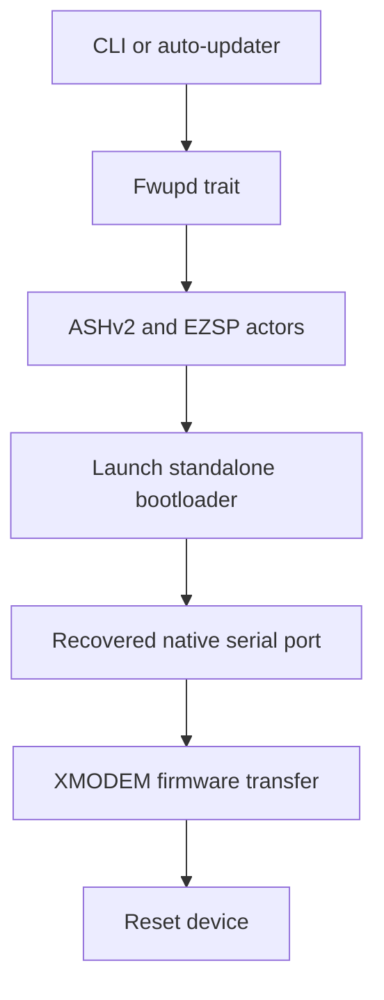
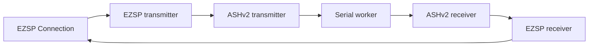

# Architecture

The workspace contains the `ezsp-fwupd` library, an interactive CLI, and an automatic updater. The
library owns bootloader entry, OTA parsing, and XMODEM transfer behavior; the binaries provide user
and service workflows around those operations.

## Firmware update flow

The serial port starts as a blocking native `serialport` value because the bootloader and XMODEM
stages use the synchronous serial-port API. During bootloader entry, `async-serialport` temporarily
splits that value into Tokio `AsyncRead` and `AsyncWrite` halves plus a worker that retains ownership
of the original port.

## Actor stack

`make_uart` starts the serial worker, both ASHv2 actors, and both EZSP actors. It negotiates the
requested EZSP protocol version before returning an `ezsp::Connection`. Asynchronous callbacks are
consumed by a logging discard task because firmware update workflows do not act on them.

The returned `Tasks` value owns all actor join handles. `Tasks::terminate` aborts and joins the
protocol actors, allowing the async serial halves to close; it then joins the serial worker and
returns the original native port. This explicit ownership transition is required before the same
port can be used for bootloader XMODEM traffic.

## OTA and XMODEM

`OtaFile` parses and validates Zigbee OTA containers and exposes their firmware payload. The XMODEM
module divides that payload into 128-byte frames, pads the final frame, calculates XMODEM CRC-16
checksums, retries negative acknowledgements, and reports progress through an optional `indicatif`
progress bar.
