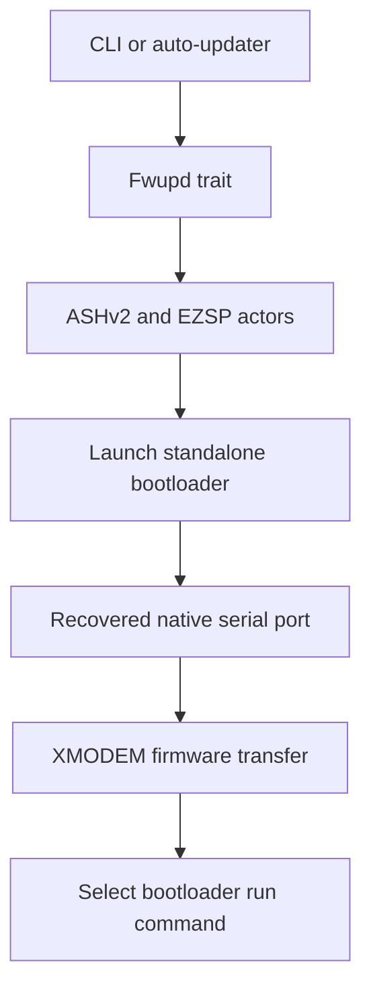
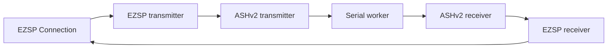

# Architecture

The workspace contains the `ezsp-fwupd` library, an interactive CLI, and an automatic updater. The
library owns bootloader entry, OTA parsing, and XMODEM transfer behavior; the binaries provide user
and service workflows around those operations.

## Firmware update flow

The serial port starts as a blocking native `serialport` value because the bootloader and XMODEM
stages use the synchronous serial-port API. During bootloader entry, `async-serialport` temporarily
splits that value into Tokio `AsyncRead` and `AsyncWrite` halves plus a worker that retains ownership
of the original port.

## Actor stack

`make_uart` starts the serial worker, both ASHv2 actors, and both EZSP actors. It negotiates the
requested EZSP protocol version before returning an `ezsp::Connection`. Asynchronous callbacks are
consumed by a logging discard task because firmware update workflows do not act on them.

The returned `Tasks` value owns all actor join handles. `Tasks::terminate` aborts and joins the
protocol actors, allowing the async serial halves to close; it then joins the serial worker and
returns the original native port. This explicit ownership transition is required before the same
port can be used for bootloader XMODEM traffic.

## Bootloader console transition

After the EZSP command launches the standalone bootloader, the UART no longer carries ASHv2 or
EZSP frames. `Fwupd` temporarily disables the application's serial flow control, sends a carriage
return, and reads until the bootloader's `BL >` ASCII prompt. It then selects menu option `1` and
waits for the first ASCII `C`, which is the receiver's XMODEM-CRC readiness signal. Fixed menu or
banner lengths are deliberately not used because bootloader versions can emit different text.

These ASCII menu operations, including menu option `2` for running the application, are exposed by
the `GeckoBootloader` trait. The separate `Transmit` trait adapts the firmware iterator and progress
reporting to the external `xmodem` crate.

When the update finishes or fails, `Fwupd` restores the original serial timeout and flow-control
settings. A successful update selects bootloader menu option `2` to run the uploaded application.

## OTA and XMODEM

`OtaFile` parses and validates Zigbee OTA containers and exposes their firmware payload. The
third-party `xmodem` crate performs XMODEM-CRC negotiation, standard 128-byte framing, `SUB` padding,
error-budget handling, and the acknowledged end-of-transmission exchange. A small reader adapter
reports one optional `indicatif` progress increment for each firmware block supplied to the crate.
