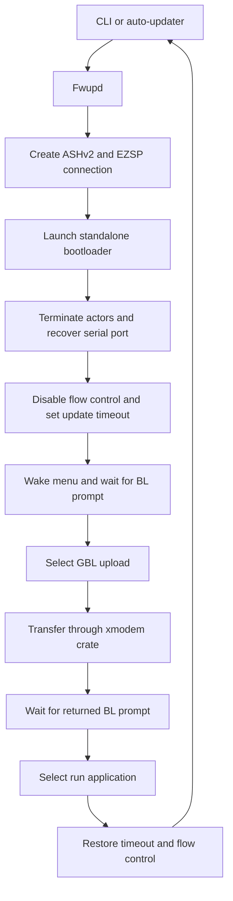
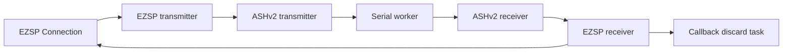

# Architecture

The workspace separates reusable firmware-update mechanics from interactive and unattended user
workflows.

| Package | Responsibility |
| --- | --- |
| `ezsp-fwupd` | ASHv2/EZSP lifecycle, Gecko bootloader commands, OTA parsing, and XMODEM adaptation |
| `cli` | Interactive flash, reset, version-query, and OTA-inspection commands |
| `auto-updater` | Manifest selection, version comparison, update execution, reboot wait, and validation |

## Firmware update flow

`Fwupd` owns this orchestration. It consumes a native `SerialPort`, performs the asynchronous and
synchronous phases, and resolves to the same concrete port type. Serial settings are restored after
success or failure. If the update and restoration both fail, the update error is returned and the
restoration error is logged.

## ASHv2 and EZSP actor stack

`make_uart` uses `async-serialport` to split the native port into Tokio-compatible reader and writer
halves. It starts the serial worker, both ASHv2 actors, and both EZSP actors, then negotiates the
requested EZSP protocol version. Firmware-update workflows discard asynchronous EZSP callbacks
because they do not consume application events.

`Tasks` owns the serial worker and all protocol actor handles. `Tasks::terminate` aborts and joins the
actors first, allowing the asynchronous serial halves to close, and then joins the worker to recover
the native serial port. This ownership transition must complete before synchronous bootloader I/O
can begin.

`LaunchBootloader` is an internal extension trait that builds this stack with the firmware updater's
channel sizes and EZSP protocol version, sends `launchStandaloneBootloader`, drops the connection,
and terminates the tasks.

## Gecko console and XMODEM boundary

Once the standalone bootloader starts, the UART carries an ASCII console rather than ASHv2 or EZSP
frames. The `GeckoBootloader` trait owns that console protocol; the external `xmodem` crate owns the
binary transfer protocol.

| Phase | Host output | Expected device output | Owner |
| --- | --- | --- | --- |
| Wake console | Carriage return | Text ending in `BL >` | `GeckoBootloader` |
| Select upload | ASCII `1` | Console text ending in ASCII `C` | `GeckoBootloader` |
| Transfer | XMODEM-CRC blocks and `EOT` | Block acknowledgements and final `ACK` | `xmodem` |
| Return to menu | Nothing | Completion text ending in `BL >` | `GeckoBootloader` |
| Run application | ASCII `2` | Optional startup output | `GeckoBootloader` |

`start_xmodem_upload` consumes the bootloader's console response through the initial `C`. A one-byte
adapter then replays that already-observed request to `Xmodem::send`, which needs it to select CRC16
mode. This prevents any preceding status text from consuming the XMODEM retry budget. Menu
synchronization uses stable terminators instead of fixed response lengths because bootloader banners
and menu text can vary. A response is bounded to 1024 bytes so an unexpected stream cannot grow
memory without limit.

Gecko UART bootloaders normally run without flow control, while NCP application firmware commonly
uses RTS/CTS or XON/XOFF. `Fwupd` records the application's setting before bootloader entry, disables
flow control for the console and transfer, and restores it together with the original timeout at the
end.

## XMODEM adapter

`Transmit` is an internal extension trait implemented for native serial ports. It delegates protocol
behavior to `xmodem` 0.4 with these settings:

- standard 128-byte blocks;
- CRC16 selected from the bootloader's validated and replayed initial `C`;
- `SUB` padding supplied by the dependency;
- an error budget of ten unexpected responses or read timeouts.

The public `Fwupd` API accepts any `IntoIterator<Item = u8>`, while `Xmodem::send` requires a `Read`
source. `FirmwareReader` bridges those interfaces without collecting another copy of the firmware.
Each successful non-empty read advances the optional progress bar once, matching one standard block.
`FrameCount` uses the same 128-byte size when callers construct that bar.

Errors from `xmodem` are mapped into `std::io::Error`: cancellation becomes `ConnectionAborted`,
protocol violations become `InvalidData`, native I/O errors are preserved, and exhausted retries
become a general I/O error.

The current `xmodem` release advances its input after an unexpected per-block response instead of
replaying the same block. On a noisy link the receiver will normally reject the subsequent sequence
and the transfer will exhaust its error budget. This limitation is recorded in the Cargo Vet audit
and should be reconsidered when upgrading the dependency.

## OTA parsing and updater layers

`OtaFile` parses the Zigbee OTA header, optional fields, tag metadata, and remaining firmware
payload. The CLI and automatic updater validate the OTA magic before passing the payload iterator to
`Fwupd`.

The CLI provides direct operator control and an `indicatif` progress bar. The automatic updater adds
manifest deserialization, semantic-version direction selection, a reboot grace period, and a second
ASHv2/EZSP connection that verifies the running firmware version after the update.

Manifest loading separates file access from JSON deserialization. A missing file or inactive
manifest returns no metadata; other I/O errors and deserialization errors propagate to the caller.
